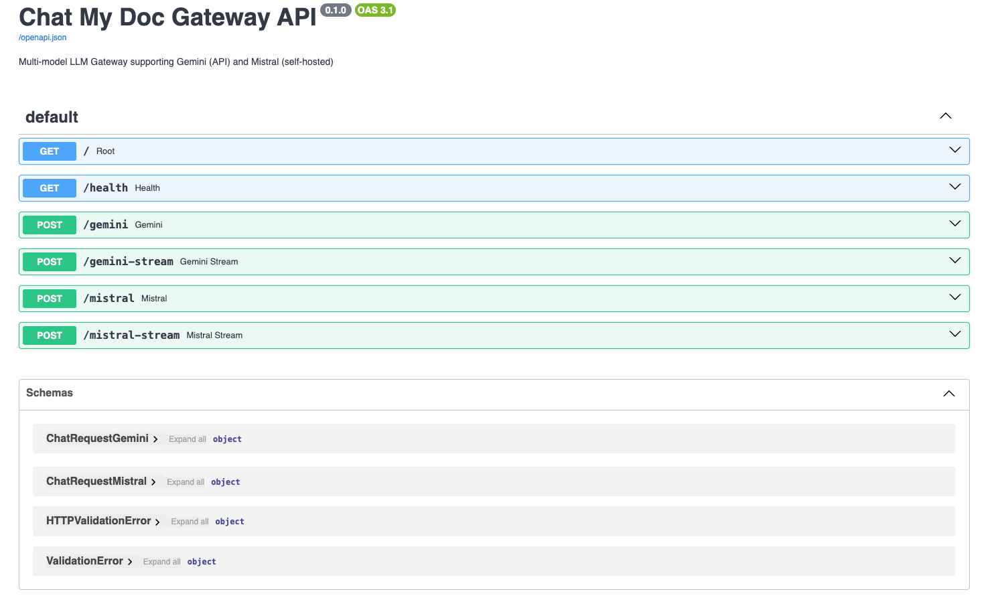

# Chat My Doc LLMs

A FastAPI-based application that provides a unified gateway for multiple LLM providers including Google Gemini and Mistral models for AI-powered conversations.




## Features

- **Multi-LLM Support**: Integration with Google Gemini (2.0 Flash, 1.5 Pro) and Mistral models
- **Streaming & Non-streaming APIs**: Support for both real-time streaming and standard responses
- **FastAPI Gateway**: Modern REST API with automatic documentation
- **BentoML Deployment**: Containerized Mistral model deployment with BentoML
- **Infrastructure as Code**: Ansible-based deployment automation
- **Comprehensive Testing**: Unit tests with pytest and async support
- **Type Safety**: Full mypy type checking and ruff linting

## Prerequisites

- Python 3.11+
- uv (Python package manager)
- Docker (for containerized deployment)
- Google API key for Gemini access
- Mistral API endpoint (for Mistral model access)
- Ansible (for infrastructure deployment)

## Installation

### Local Development

1. Clone the repository:
```bash
git clone <repository-url>
cd chat-my-doc-llms
```

2. Install dependencies using uv:
```bash
uv sync --locked
```

3. Set up environment variables:
```bash
export GOOGLE_API_KEY=your_google_api_key
export MISTRAL_API_URL=http://your-mistral-endpoint:3000
```

## Usage

### Local Development

Start the development server:
```bash
make run_api_dev
# or
uv run fastapi dev src/chat_my_doc_llms/gateway.py
```

Start the production server:
```bash
make run_api
# or
uv run fastapi run src/chat_my_doc_llms/gateway.py
```

The API will be available at `http://localhost:8000`

### API Endpoints

#### Core Endpoints
- `GET /` - Root endpoint returning a welcome message
- `GET /health` - Health check endpoint

#### Gemini Endpoints
- `POST /gemini` - Chat with Gemini models (non-streaming)
- `POST /gemini-stream` - Chat with Gemini models (streaming)

#### Mistral Endpoints  
- `POST /mistral` - Chat with Mistral model (non-streaming)
- `POST /mistral-stream` - Chat with Mistral model (streaming)

### Example Usage

#### Gemini Chat
```bash
curl -X POST "http://localhost:8000/gemini" \
  -H "Content-Type: application/json" \
  -d '{"prompt": "Hello, how are you?", "model_name": "gemini-2.0-flash-lite"}'
```

#### Mistral Chat
```bash
curl -X POST "http://localhost:8000/mistral" \
  -H "Content-Type: application/json" \
  -d '{"prompt": "Explain quantum computing"}'
```

#### Streaming Example
```bash
curl -X POST "http://localhost:8000/gemini-stream" \
  -H "Content-Type: application/json" \
  -d '{"prompt": "Write a story about AI", "model_name": "gemini-2.0-flash"}' \
  --no-buffer
```

## Deployment

### Docker Deployment

#### Build and Run Gateway Locally
```bash
make build_docker_image
docker run -p 8000:8000 \
  -e GOOGLE_API_KEY=your_key \
  -e MISTRAL_API_URL=http://your-mistral-endpoint:3000 \
  llm-gateway:latest
```

### BentoML Mistral Service Deployment

Deploy the Mistral model service using Ansible:

```bash
# Deploy Mistral service to remote server
make deploy-mistral

# Restart existing service
make restart-mistral

# Debug deployment
make deploy-mistral-debug
```

### Google Cloud Run Deployment

#### Prerequisites
1. Set up Google Cloud Project
2. Enable Cloud Run API  
3. Create service account with appropriate permissions
4. Set up GitHub secrets and variables:

**Secrets:**
- `GCP_SA_KEY` - Service account JSON key
- `GCP_PROJECT_ID` - Your Google Cloud project ID
- `GOOGLE_API_KEY` - Your Google API key

**Variables:**
- `GCP_REGION` - Deployment region (default: australia-southeast1)
- `SERVICE_NAME` - Cloud Run service name

#### Manual Deployment
```bash
# Build and tag image
make build_docker_image
make tag_docker_image_for_gcp

# Push to Google Artifact Registry
make push_docker_image_to_gcp
```

## Project Structure

```
chat-my-doc-llms/
├── src/
│   ├── chat_my_doc_llms/
│   │   ├── __init__.py
│   │   ├── gateway.py           # FastAPI application & routing
│   │   ├── chats.py             # LLM integration logic
│   │   └── deploy/
│   │       └── service.py       # BentoML service definition
│   └── deploy/                  # Infrastructure as Code
│       ├── inventory.yml        # Ansible inventory
│       ├── playbooks/           # Ansible playbooks
│       │   ├── deploy-mistral.yml
│       │   └── restart-mistral-app.yml
│       ├── vars/                # Ansible variables
│       │   ├── main.yml
│       │   └── vault.yml        # Encrypted secrets
│       └── roles/               # Ansible roles
├── tests/
│   └── unit/                    # Unit tests
│       ├── test_chats.py
│       └── test_gateway.py
├── .github/
│   └── workflows/
│       └── deploy_cloud_run.yaml # CI/CD pipeline
├── Dockerfile                   # Container configuration
├── Makefile                     # Build and deployment commands
├── pyproject.toml              # Python project configuration
└── uv.lock                     # Dependency lock file
```

## Development

### Code Quality
```bash
# Run linting
make ruff

# Run type checking  
make mypy

# Run tests with coverage
make test

# Clean build artifacts
make clean
```

### Testing
```bash
# Run all tests
uv run pytest tests/unit -v

# Run specific test file
uv run pytest tests/unit/test_gateway.py -v

# Run with coverage
uv run pytest tests/unit -v --cov=src --cov-report=html
```

## Dependencies

- **FastAPI** - Modern web framework for building APIs
- **Google GenAI** - Google's generative AI models integration  
- **BentoML** - Model serving framework for ML deployments
- **HTTPX** - Async HTTP client for API calls
- **Ansible** - Infrastructure automation and deployment
- **pytest** - Testing framework with async support

## Environment Variables

### Required
- `GOOGLE_API_KEY` - Required for Gemini model access
- `MISTRAL_API_URL` - URL endpoint for Mistral model service

### Optional  
- `PORT` - Server port (default: 8000)
- `HF_TOKEN` - Hugging Face token for model downloads
- `HF_HOME` - Hugging Face cache directory
- `TORCH_HOME` - PyTorch cache directory

## Contributing

1. Fork the repository
2. Create a feature branch
3. Make your changes
4. Ensure tests pass
5. Submit a pull request